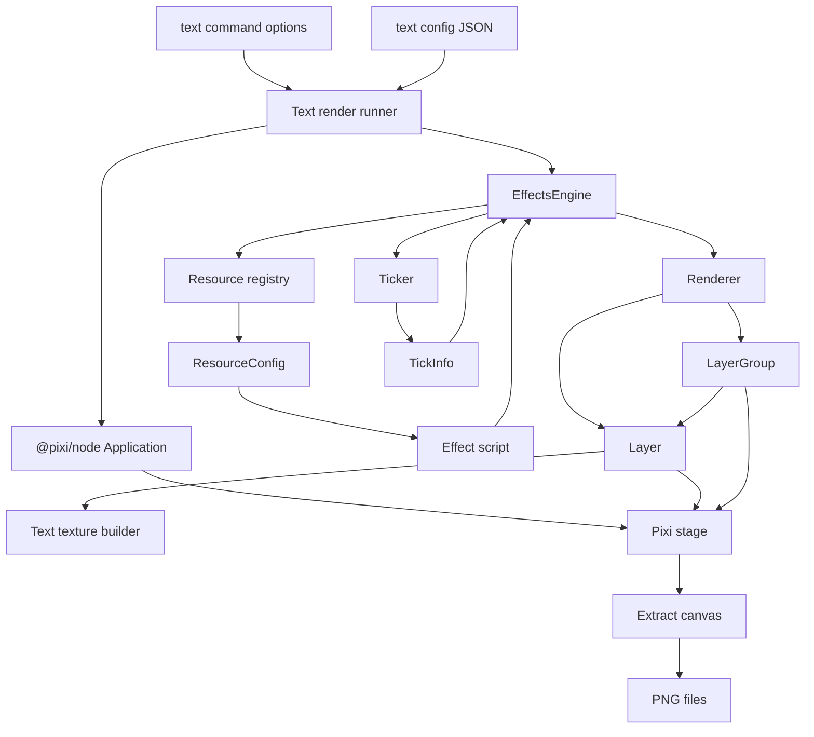

# Offscreen Rendering Design

## 1. Module Scope

`@baidu/offscreen-render` is a server-side/offscreen rendering package in `fe-common/packages/offscreen-render`. Its current primary scenario is generating text effect images or PNG frame sequences from a JSON text configuration and a named shader effect.

The module is not an interactive video editor canvas. It has no timeline UI, no element dragging, no user interaction model, and no long-lived preview session. It is closer to a deterministic render worker:

```text
Input
  text config + effect name + duration + resolution + output path

Offscreen renderer
  creates Pixi node application
  creates text texture
  builds shader layer tree
  advances a deterministic ticker
  extracts each frame from the stage

Output
  text.png
  0.png, 1.png, 2.png ...
  log.json
```

The package currently focuses on text effects. It can generate a static PNG when duration is absent, or a PNG sequence when duration is provided.

## 2. Relationship To Video Canvas Rendering

The browser video canvas and the offscreen renderer share the same broad rendering philosophy:

- Effect resources describe shader layers declaratively.
- Runtime entities turn resource descriptions into Pixi display objects.
- Time is injected through uniforms such as progress and current time.
- Optional effect scripts can rewrite effect state per frame.
- Text can be converted into a texture and then used by shader effects.

The execution model is different:

```text
Browser video board
  environment: browser Pixi / DOM media elements
  goal: interactive preview and editing feedback
  timing: playback loop, seek, pause, user-driven updates
  output: visible canvas

Offscreen renderer
  environment: Node.js + @pixi/node + node-canvas
  goal: deterministic asset or frame generation
  timing: fixed FPS frame stepping
  output: PNG files and render log
```

So the offscreen renderer can be treated as a batch rendering pipeline that reuses effect-engine ideas from the preview side, but it should not be modeled as a full video board.

## 3. Core Design Idea

The module is organized around four separations:

```text
Command layer
  parses render parameters and starts a task

Task layer
  reads config, creates Pixi application, owns output files

Effect engine
  owns effect resources, timeline clock, script hooks, renderer updates

Renderer layer
  owns shader meshes, texture binding, uniform resolution, stage mounting
```

The central idea is:

```text
Text configuration becomes a texture.
Effect resources become shader layers.
Ticker time becomes shader uniform values.
Rendered stage becomes PNG files.
```

## 4. Core Entities

### CLI Program

The CLI entry registers the `text` command and installs the Node canvas `ImageData` implementation into the global environment so Pixi can run in Node.

Responsibilities:

- Bootstrap the command program.
- Register supported render commands.
- Provide Node-compatible image primitives.

### Text Command

The `text` command is the public task interface.

Main options:

- `config`: path to the text JSON configuration.
- `effect`: named effect resource key.
- `resolution`: output canvas size.
- `duration`: render duration in seconds; absent or non-positive means static render.
- `output`: output directory.
- `FPS`: expected frame rate option.

Conceptually, this command describes a single offscreen render job.

### Text Render Runner

The text runner owns the end-to-end batch task.

Responsibilities:

- Resolve output resolution.
- Read and normalize the text config.
- Create the output directory.
- Create the Pixi node application.
- Create and initialize `EffectsEngine`.
- Mount generated effect layers into the Pixi stage.
- Render static output or frame sequence.
- Write render timing log.

It is the orchestration layer between command options and the rendering engine.

### EffectsEngine

`EffectsEngine` is the runtime coordinator for one effect render.

Responsibilities:

- Resolve the requested effect resource.
- Fall back to a common effect when the effect key is unknown.
- Hold global render dimensions, duration, FPS, source texture, and texture location.
- Instantiate an optional effect script.
- Initialize effect definitions into renderer layers.
- Own the deterministic ticker.
- Update time and progress uniforms per frame.
- Invoke effect script hooks.
- Ask the renderer to apply the next effect state.

The engine does not write files. It produces updated Pixi layer state.

### Ticker

`Ticker` is a deterministic frame clock.

Responsibilities:

- Hold current render time.
- Convert FPS into fixed frame duration.
- Return frame timing info: last time, current time, total time.
- Mark playback as ended when current time reaches duration.

It is independent of wall-clock time. That makes it suitable for server generation because each render advances by discrete frame intervals.

### Renderer

`Renderer` converts effect definitions into runtime layer objects.

Responsibilities:

- Hold the canvas width and height.
- Create one top-level `Layer` or `LayerGroup` per effect.
- Keep layer ordering aligned with the effect array.
- Forward updated effect state to matching runtime layers.

The renderer is intentionally thin. It does not interpret command options or output files.

### Layer

`Layer` is the runtime form of one shader effect.

Responsibilities:

- Resolve source texture into Pixi `Texture`.
- Build a full-screen Pixi mesh.
- Create shader from vertex and fragment shader source.
- Initialize global uniforms.
- Resolve dynamic uniforms from effect data.
- Compute texture transform, size, offset, and angle uniforms.
- Update shader uniforms on each frame.

The mesh geometry covers the full render screen. The visible source area is controlled by texture uniforms and shader logic.

### LayerGroup

`LayerGroup` is a container for grouped sub-effects.

Responsibilities:

- Create child `Layer` instances for `subEffects`.
- Add all child layer meshes into a Pixi container.
- Forward per-frame sub-effect state into matching child layers.

This is used by effects that split a source into multiple animated pieces, such as per-character text animation.

### Resource Registry

The resource registry maps effect names to resource configs.

Current named text effects include:

- `text_bdcx`
- `text_bk`
- `text_cmw`
- `text_mohu`
- `text_xpfl`
- `text_dcjx`

Each resource config may contain:

- one or more shader effects
- vertex shader source
- fragment shader source
- uniform declarations
- an optional script class

### Effect Script

An effect script is an optional resource-level controller.

Responsibilities:

- Expand or rewrite the initial effect tree.
- Create sub-effects.
- Create animation state.
- Seek internal animation timelines by tick time.
- Mutate locations and custom uniforms per frame.

For example, a text effect can split the text into characters, create one sub-layer per character, and drive each character with staggered GSAP animation.

### Text Texture Builder

The text texture builder converts text style data into a canvas texture.

Responsibilities:

- Split text into positioned characters.
- Resolve font, color, opacity, stroke, shadow, underline, and background.
- Render gradient fills with a mask-based strategy.
- Render text, stroke, shadow, and background into layered Pixi containers.
- Extract the container to a node canvas.
- Optionally write `text.png` for debugging or inspection.
- Return the canvas as the source texture for shader rendering.

This entity is important because shader effects operate on a texture, not on editable text primitives.

## 5. Core Data Model

### Command Option

The command option is the task-level input.

```text
TextCommandOption
  config
  effect
  resolution
  duration
  output
  FPS
```

This data controls where input comes from, how large the stage is, how long the render lasts, and where output is written.

### Normalized Text Config

The JSON config is normalized into:

```text
TextConfig
  text
  location
    x
    y
    width
    height
    angle
  textStyle
    font family
    font size
    font color / alpha
    bold / italic / underline
    stroke
    shadow
    foreground gradient
    background color / gradient
    line and character spacing
    layout direction
```

The config normalization bridges business/editor naming into render-engine naming. For example, source `rotate` becomes render `angle`.

### Resource Texture

The engine sees the source as a resource texture:

```text
ResourceTexture
  textInfo?
    text
    textStyle
  src?
```

When `textInfo` exists, the runtime builds a canvas texture from text. When `src` exists, it can load a texture from an image source.

### Texture Location

Texture location describes how the source texture is positioned inside the render screen:

```text
TextureLocation
  x
  y
  width
  height
  angle
```

This is converted into shader-facing matrix, size, offset, and angle uniforms.

### Resource Config

Resource config is the declarative effect description:

```text
ResourceConfig
  script?
  effects[]
    vertex
    fragment
    uniforms[]
```

Uniform declarations are typed. Types include:

- texture
- global size
- texture size
- texture offset
- texture angle
- texture matrix
- progress
- time
- float
- float array

### Effect State

Effect state is the runtime copy of resource config plus injected source data:

```text
EffectOption
  vertex
  fragment
  texture
  location
  uniforms
  subEffects?
```

This is the main data object passed from engine to renderer on each frame.

### Tick Info

Tick info is the time payload for one render step:

```text
TickInfo
  lastTime
  current
  totalTime
```

Scripts use it to seek animations and compute per-frame effect state.

### Output Artifact

The output is filesystem-based:

```text
output directory
  text.png       optional source texture snapshot
  0.png         first rendered frame or static render
  1.png
  2.png
  ...
  log.json      start/end/cost
```

Video assembly is not owned by this package. If a final video file is needed, another service or tool should combine the PNG sequence.

## 6. Runtime Rendering Flow

### Static Text Image Flow

```text
Run text command
  -> read config JSON
  -> normalize text style and location
  -> create @pixi/node Application
  -> create EffectsEngine
  -> resolve effect resource
  -> create text source canvas
  -> create shader layer(s)
  -> mount layer(s) to stage
  -> render stage once
  -> extract stage canvas
  -> write 0.png
  -> write log.json
```

This path is used when duration is absent or not greater than zero.

### Animated Frame Sequence Flow

```text
Run text command with duration
  -> initialize the same application and engine
  -> while ticker has not ended
       -> ticker returns current frame time
       -> engine updates progress/time uniforms
       -> optional script seeks animation and mutates effects
       -> renderer updates shader layer uniforms
       -> Pixi renders stage
       -> renderer extracts stage canvas
       -> write frame as N.png
  -> write log.json
```

The frame loop is synchronous and serial. It renders, extracts, encodes, and writes one PNG at a time.

### Effect Initialization Flow

```text
Requested effect name
  -> lookup resource registry
  -> if found: use named resource
  -> if not found: use common resource
  -> inject texture and location into each effect
  -> optional script init
       -> may split text
       -> may create subEffects
       -> may create animation timelines
  -> renderer creates Layer or LayerGroup objects
```

### Per-Frame Update Flow

```text
Ticker tick
  -> current time and progress
  -> clone base effect state
  -> update TIME and PROGRESS uniforms
  -> optional script tick
       -> seek animation
       -> update locations
       -> update custom uniforms
  -> renderer render
       -> Layer resolves typed uniforms
       -> Layer writes shader.uniforms
  -> Pixi stage render
  -> PNG extraction
```

### Text Texture Flow

```text
TextInfo
  -> SplitTextTool calculates character positions
  -> TextElement creates layered Pixi containers
       -> background
       -> shadow
       -> stroke
       -> text
       -> underline
  -> gradient resources create canvas-backed textures
  -> each character is rendered into a sprite
  -> full text container is extracted to canvas
  -> canvas becomes Pixi Texture
  -> texture is bound as uTexture1
```

## 7. Main Logical Relationships



```text
ResourceConfig
  describes what can be rendered

EffectOption
  describes the current runtime state of one effect

Layer / LayerGroup
  materializes EffectOption into Pixi display objects

Ticker
  controls which state should exist at a frame

Text render runner
  controls task lifetime and output persistence
```

## 8. Review Findings

### 8.1 FPS Option Is Not Wired Into The Engine

The command declares `--FPS`, and `EffectsEngine` supports an optional `fps`, but the text runner does not pass `option.FPS` into the engine. As a result, CLI users can request a frame rate, but rendering still uses the engine default of 30fps.

Relevant source:

- `packages/offscreen-render/src/commands/text.ts:16`
- `packages/offscreen-render/src/modules/text/index.ts:23`
- `packages/offscreen-render/src/engine/index.ts:30`

Impact:

- Generated frame count can be wrong for non-30fps jobs.
- Timing-sensitive effects can differ from caller expectations.
- Downstream video assembly may use a different FPS than the generated sequence assumes.

Recommendation:

- Normalize `option.FPS` as a number.
- Pass it into `EffectsEngine`.
- Record FPS in `log.json`.

### 8.2 Duration And Progress Need Stronger Guards

The ticker and engine compute progress as `current / totalTime`. If duration is undefined, zero, or invalid in an animated path, progress can become invalid. The current static path avoids ticking when duration is not positive, but the type model still allows undefined or non-number duration to enter the engine.

Relevant source:

- `packages/offscreen-render/src/modules/text/index.ts:26`
- `packages/offscreen-render/src/engine/index.ts:87`
- `packages/offscreen-render/src/engine/Ticker.ts:16`

Impact:

- Invalid command input can produce NaN progress.
- Effect scripts may receive unexpected timing values.

Recommendation:

- Validate duration before creating the engine.
- Separate static render options from animated render options.
- Clamp progress with a minimum positive denominator.

### 8.3 Global OUTPUT_DIR Couples Texture Debug Output To Task State

The runner stores output directory in `process.env.OUTPUT_DIR`, and text texture generation reads it to write `text.png`.

Impact:

- Concurrent jobs in the same process can conflict.
- Texture creation has hidden filesystem side effects.
- Unit tests and server integrations are harder to isolate.

Recommendation:

- Pass output/debug context explicitly into the text texture builder.
- Make `text.png` emission configurable.
- Avoid process-wide mutable state for per-task data.

### 8.4 Per-Frame Canvas Extraction And Base64 Encoding Can Be Expensive

Each frame renders the stage, extracts a canvas, converts it to a base64 PNG data URL, strips the prefix, and writes the decoded base64 to disk.

Relevant source:

- `packages/offscreen-render/src/modules/text/index.ts:46`

Impact:

- Extra memory churn for large resolutions or long durations.
- Base64 conversion adds CPU and allocation overhead.
- Long jobs may put pressure on Node heap and native canvas memory.

Recommendation:

- Prefer direct PNG buffer output when available.
- Explicitly destroy temporary Pixi/canvas resources after render jobs.
- Add stress tests for high resolution and longer duration cases.

### 8.5 Shader Failure Detection Looks Too Narrow

After the first render, the runner checks a renderer shader GL error path. This can catch some WebGL failures, but it does not provide structured diagnostics for shader compilation, missing uniforms, texture failures, or script failures.

Relevant source:

- `packages/offscreen-render/src/modules/text/index.ts:37`

Impact:

- Failed renders may be difficult to diagnose from logs.
- Some shader or resource failures can surface only as blank output.

Recommendation:

- Add explicit validation for shader resources before render.
- Capture effect name, resolution, duration, FPS, frame index, and error stage in logs.
- Consider writing a failure artifact with normalized render options.

### 8.6 Resource Lifecycle Is Implicit

The task creates Pixi applications, text containers, extracted canvases, textures, meshes, and filters, but there is no explicit cleanup phase in the runner.

Impact:

- Repeated server-side jobs in one process may accumulate native resources.
- Long-running worker processes can become unstable under batch load.

Recommendation:

- Add an explicit dispose path after success and failure.
- Destroy Pixi application and generated textures.
- Keep cleanup in a `finally` block.

### 8.7 Common Resource Fallback Can Hide Invalid Effect Names

When an effect key is unknown, the engine silently falls back to `commonResource`.

Relevant source:

- `packages/offscreen-render/src/engine/index.ts:33`

Impact:

- Misconfigured jobs can appear successful while rendering the wrong effect.
- Batch pipelines may miss bad effect names.

Recommendation:

- In CLI/server mode, fail fast on unknown effect unless the caller explicitly asks for fallback.
- Include selected resource key in `log.json`.

## 9. Suggested Abstractions

### RenderJob

Represents one server-side render request.

```text
RenderJob
  input config path or config object
  effect name
  output directory
  width / height
  duration
  fps
  debug artifact policy
```

This would replace loose command options as the internal task contract.

### RenderContext

Represents per-job runtime context.

```text
RenderContext
  Pixi application
  output writer
  logger
  resource registry
  debug artifact writer
```

This avoids global process state and makes concurrent rendering safer.

### FrameWriter

Owns frame serialization and output naming.

```text
FrameWriter
  writeFrame(index, canvas)
  writeSourceTexture(canvas)
  writeLog(summary)
```

This isolates file format and naming decisions from render orchestration.

### EffectResourceResolver

Owns effect lookup policy.

```text
EffectResourceResolver
  resolve(effectName)
  validate(effectName)
  chooseFallback(effectName)
```

This makes the fallback behavior explicit and easier to vary between local debugging and production generation.

### ResourceDisposer

Owns cleanup for Pixi and native resources.

```text
ResourceDisposer
  register(resource)
  disposeAll()
```

This is useful for long-running render workers where native memory matters.

## 10. Production Notes

For service-side generation, the module should be treated as a deterministic render worker with strict input validation and explicit resource cleanup.

Important production concerns:

- Font availability must be controlled on the render machine.
- Effect resources and shader source should be versioned with render jobs.
- FPS and duration should be logged with output artifacts.
- Output paths should be job-scoped and collision-free.
- Blank-frame detection would be useful after shader or texture changes.
- Concurrency should avoid process-wide mutable render state.
- Render failures should be diagnosable by frame index and stage.

## 11. Source Map

Key files:

- `packages/offscreen-render/src/cli.ts`: CLI bootstrap.
- `packages/offscreen-render/src/commands/text.ts`: text command definition.
- `packages/offscreen-render/src/modules/text/index.ts`: render task orchestration and PNG output.
- `packages/offscreen-render/src/engine/index.ts`: effect engine and per-frame state update.
- `packages/offscreen-render/src/engine/Ticker.ts`: deterministic frame clock.
- `packages/offscreen-render/src/engine/renderer/index.ts`: top-level renderer.
- `packages/offscreen-render/src/engine/renderer/Layer.ts`: shader mesh and uniform binding.
- `packages/offscreen-render/src/engine/renderer/LayerGroup.ts`: grouped sub-effect layers.
- `packages/offscreen-render/src/engine/renderer/utils.ts`: text texture construction and texture resolution.
- `packages/offscreen-render/src/engine/resource/index.ts`: effect resource registry.
- `packages/offscreen-render/src/engine/resource/text_*`: concrete text effect resources.
- `packages/offscreen-render/src/engine/tools`: text splitting, math, uniform helper tools.

